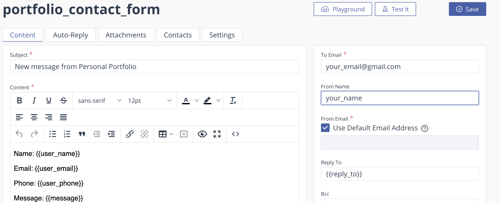

# Portfolio Template v1.0.0

## Quick Start
- Run on node v16.19.0 or lower
```
run 'npm i' to install dependencies
run 'npm run dev' to run on localhost:8080
run 'npm netlify-dev' to run on localhost:8888 with email function
```

## Setup for Netlify Deployment
###  Emailjs Setup
1. Create an Emailjs account: https://dashboard.emailjs.com/sign-up
2. Setup an Email Service and Email Template
  - Email Service Example
  
 
  - Email Template Example
  
  - Under Account -> API Settings check the boxes for 
 
    - "Allow EmailJS API for non-browser applications"
   
    - "Use Private Key (recommended)"
 
3. Add API and Private key to .env 

### Netlify Lambda Function Setup
1. Build or deploy directly from Github
2. Under Site Settings -> Environment Variables, add your .env variables with their associated values.  

